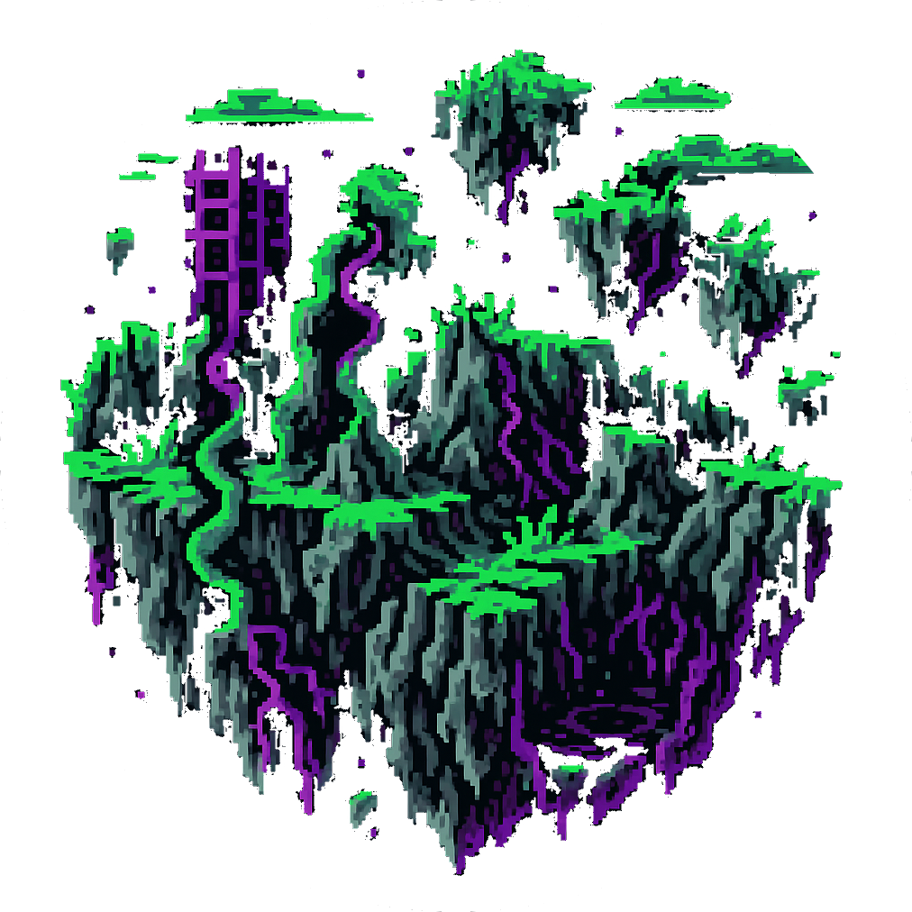

# [FarLanders ](https://www.farlanders.cc)

> [`farlanders.cc`](https://www.farlanders.cc)

FarLanders is an open-source Minecraft server plugin that provides advanced, distance-driven world generation inspired by the legendary Far Lands.

This repository contains the generator code, preview tooling, utilities, and tests.

Quick links

- [World Generation Overview](#world-generation-overview)
- [Usage (build & test)](#usage)
- [Features](#features)
- [Commands](#commands)

---

## World Generation Overview

Terrain complexity scales with distance from spawn. The generator progressively unlocks new rules and biomes as players travel outward:

- 0–100k blocks — familiar terrain with subtle enhancements
- 100k–1M blocks — unique structures and biome variants begin to appear
- 1M–12.5M blocks — advanced distortions, floating islands, and rare resources
- 12.5M+ blocks — the Far Lands: chaotic, highly-distorted terrain and unique biomes

##### Key ideas:

- Per-biome presets control vegetation, structure rarity/variants, and terrain multipliers.
- Generation is deterministic and previewable using the included headless exporters.
- Resource distribution and structure placement are tuned for exploration balance at scale.

---

## Usage

Build the plugin (Gradle):

```bash
./gradlew clean build
```

Run tests:

```bash
./gradlew test
```

Headless preview / exporter

The project includes a headless exporter that writes a sample 16×16 chunk to a preview folder.

- Preferred (convenience):

```bash
make preview-exporter                # uses task defaults
make preview-exporter OUTPUT_DIR=build/preview/full_chunk
```

- Direct with Gradle:

```bash
./gradlew runFullChunkExporter
./gradlew -PexporterOutput=build/preview/full_chunk runFullChunkExporter
```

- Run the main class directly from the built JAR:

```bash
java -cp build/libs/<your-jar>.jar cc.farlanders.tools.FullChunkExporter build/preview/full_chunk
```

How the exporter picks the output directory

- System property: `-Dfarlanders.export.output=/path/to/out`
- Gradle project property: `-PexporterOutput=/path/to/out` (Makefile wires this to the exporter)
- First CLI argument when running the main class directly
- Default: `build/preview/full_chunk`

Tip: the preview tools are designed to run without a full Minecraft server — see `src/main/java/cc/farlanders/tools/FullChunkExporter.java` and the `tools/` folder for details.

---

## Features

- Distance-driven progressive generation (biome progression and terrain distortion)
- Biome presets: per-biome parameters for terrain, vegetation, structures, and resource bonuses
- Advanced structure placement with variant selection and rarity tuning
- Flora & vegetation generation that respects biome presets (density, types, water bias)
- Rich cave systems and floating sky-island support with rare resources
- Headless preview and full-chunk exporter for offline inspection
- Backwards compatibility helpers for Minecraft material versions

---

## Commands

These commands are provided by the plugin to manage FarLands worlds and teleportation.

- `/farlanders tp farlands` — Teleport to the dedicated FarLands world (finds or prompts to create it).
- `/farlanders tp [world] <x> <y> <z>` — Teleport to coordinates in a named world.
- `/farlanders generate` — Generate the FarLands world using the enhanced generator.

Permissions:

- `farlanders.tp` — required for teleport commands (default: op)
- `farlanders.generate` — required to run generation (default: op)

---

## Development & Contributing

We welcome contributions. A few pointers:

- Run `./gradlew test` frequently to keep changes safe.
- The generation preview tools are useful for validating terrain changes without starting a server.

If you plan to change generation algorithms, add small unit tests and a preview run that demonstrates the delta.

---

Enjoy exploring the Far Lands — and feel free to open issues or PRs with improvements.
